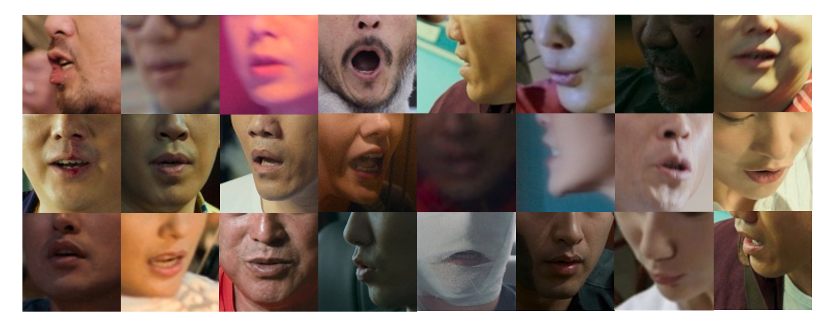

# MOV20



## Introduction

The dataset consists of video clips sourced from publicly available platforms such as YouTube, specifically from 20 movies.

Each segment is no longer than 3 minutes and covers a variety of visual and speaking conditions, including diverse lighting environments, different resolutions, and significant variations in pose, as shown above.

The video clips of each speech are provided in the format of visual frames, which are given at a reduced resolution of 96x96 pixels, focusing solely on the lip region. 

## Dataset Split

Approximately one hour of evaluation data was provided, with half used as MOV20-Val for preliminary validation and the other half as MOV20-Test for the final validation. 

Specifically, MOV20 includes a total of 2655 samples, with 1335 samples in the validation set and 1320 samples in the test set.

## File Structure and Contents

The dataset is organized into the following structure:

```
MOV20/
├── lip_imgs_96/
│   ├── val
│   │   ├── 0a4bdfb250b1b1a071b1a778486391c2.zip
│   │   ├── 0a9bde947751e803d29ed52e012b00b4.zip
│   │   ├── ...
│   ├── test
├── manifest/
│   ├── mov20_id_test.csv #  file_id for test set
│   ├── mov20_id_val.csv #  file_id for val set
```

## Accessing the Dataset

To access the MOV20 dataset, please scan the signed agreement [here](https://github.com/Physicsmile/MOV20/blob/main/MOV20-Release%20Agreement.pdf) and send it to [lipreading@vipl.ict.ac.cn](mailto:lipreading@vipl.ict.ac.cn). **Please note that the dataset is only available to universities and research institutes for research purposes only.** Note that the agreement should be signed by **a full-time staff member (usually your tutor).**  Sharing the dataset with others is **not allowed** under the terms of the agreement.